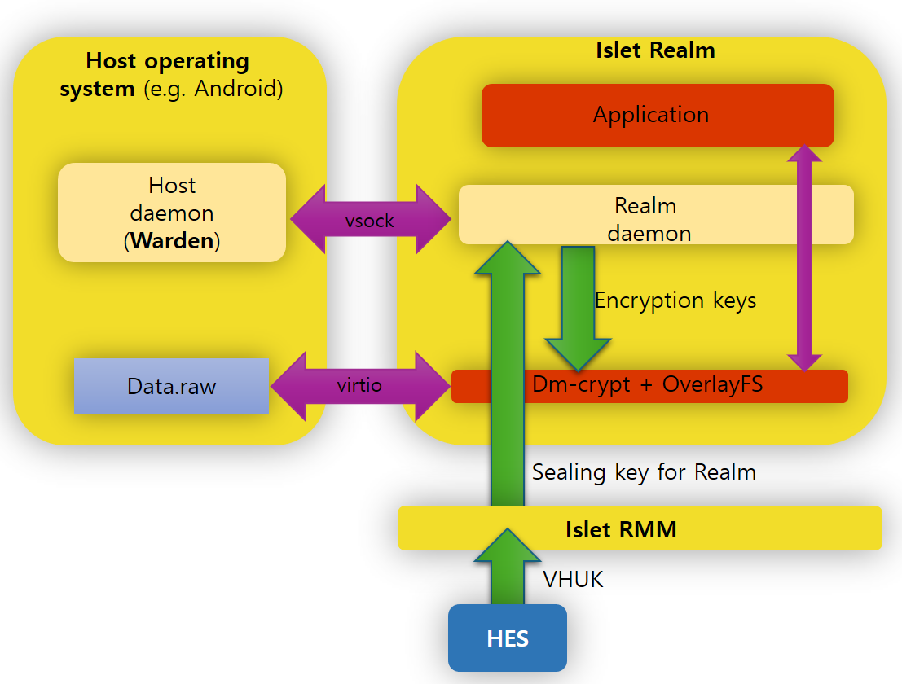

# Realm manager

This repository contains a special realm image with a compatibile host daemon used for application provisioning.

### Components in this repository
* Host daemon (`Warden`) [warden](./warden)
* Realm image (`Islet realm`) [realm](./realm)
* [Protocols](./protocol) which define messages sent on various communication channels.

Those two components cooperate and communicate with each other to provide a secure runtime environment for installling and running applications in realm.
